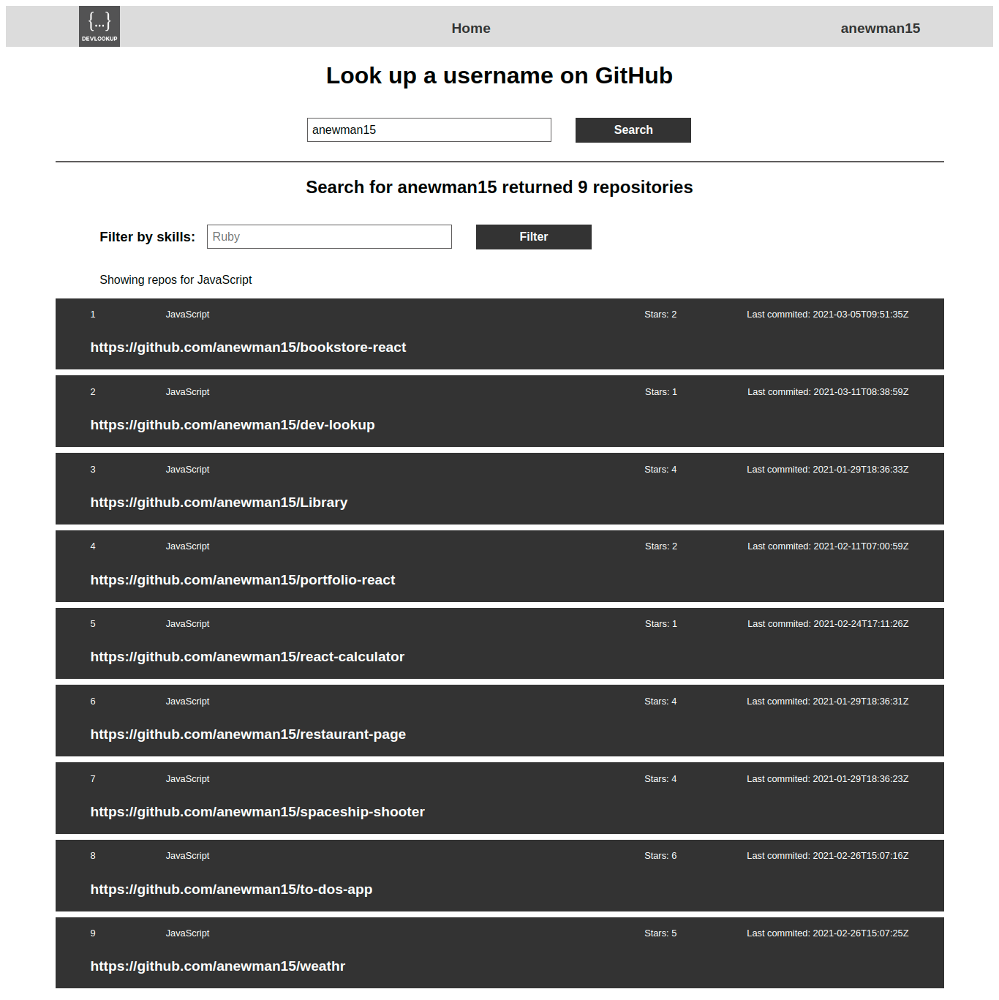

# DevLookup

This is a React app that uses the GitHub API to present information about developers. It lets you lookup a developer by GitHub username, lists all their repos if available and allows you to filter their repos according to the stack information of your interest

## Built With
1. JavaScript / ES6
2. React.js
3. Redux.js
4. GitHub API
5. Jest
6. Enzyme
7. HTML5
8. CSS3

## App Screenshot

## Live Demo
Available [here](https://dev-lookup.herokuapp.com/)

## Deployment
1. Open your Terminal from a folder of your choice and clone [this repo](https://github.com/anewman15/dev-lookup/)
2. Navigate to the project directory
3. Run `npm install`
4. Then run `npm run start`
5. Open `http://localhost:3000` in your browser and navigate around the site.
6. Navigate through the website
7. Use the form to lookup GitHub users
8. Filter results according to language

## Testing
1. Run `npm run test` in the Terminal to run the tests

## Author

👤 **Abdullah Numan**

- Github:   https://github.com/anewman15
- Twitter:  https://twitter.com/aanuman15
- Linkedin: https://www.linkedin.com/in/aanuman15/
- Email:    anewman15@hotmail.com
## Contributing

Contributions, issues and feature requests are welcome!
Please send your feedback [here](https://github.com/anewman15/dev-lookup/issues)

## Design Credits
- [Marc-Antoine Roy](https://www.behance.net/enfantroy) for the design [here](https://www.behance.net/gallery/11351281/NomNom)

## Acknowledgments
- [Microverse, Inc.](https://www.microverse.org/)
- [The Odin Project](https://www.theodinproject.com/)
